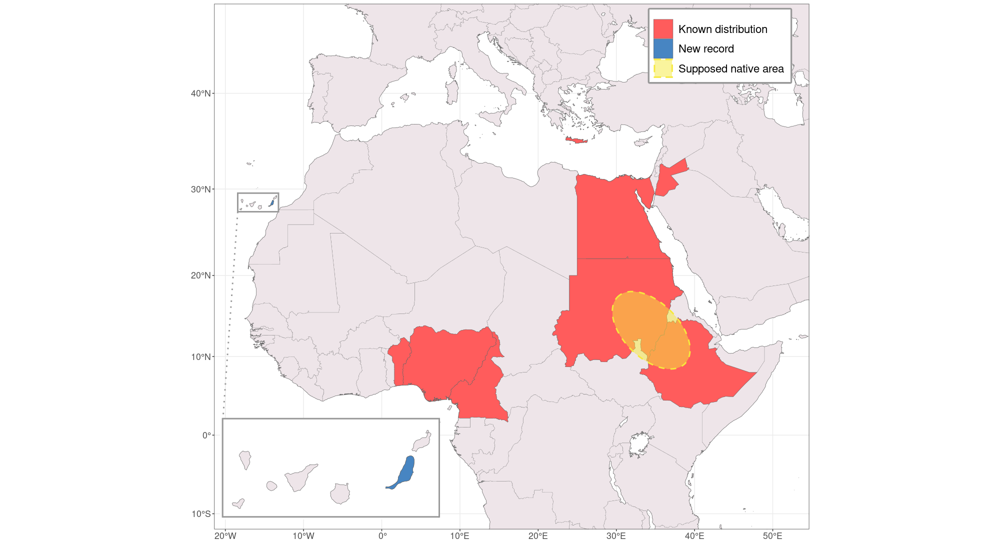

Map for paper in *BioInvasions Records*:

Kočárek P, Máslo P, Šťáhlavský F (2021) First report of the non-native webspinner *Embia* cf. *savignyi* Westwood, 1837 (Embioptera: Embiidae) in the Canary Islands with descriptions of its cytogenetic and morphological characteristics. *BioInvasions Records* 10 (in press) 

https://www.reabic.net/journals/bir/2021/Accepted/BIR_2021_Kocarek_etal_correctedproof.pdf

    @article{kovcarek2021first,
      title={First report of the non-native webspinner Embia cf. savignyi Westwood, 1837 (Embioptera: Embiidae) in the Canary Islands with descriptions of its cytogenetic and morphological characteristics},
      author={Ko{\v{c}}{\'a}rek, P and M{\'a}slo, P and {\v{S}}t'{\'a}hlavsk{\`y}, F},
      journal={BioInvasions Records},
      volume={10},
      year={2021}
    }

